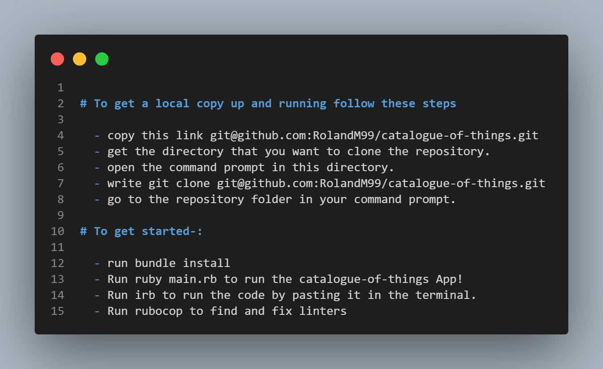

# catalogue-of-things

The app is develped in ruby and allows users to:
  - Use Ruby console app with a user interface.
  - User can add books or music albums, and you can create a label or genre or author for the said item.
  - The application preserves user data by using JSON files while exiting the application.

# Built with:

    - Ruby
    - OOP
    - SQL
  
# Technologies

  - Github
  - Rspec
  - linters
  
# Presentation
[video](https://drive.google.com/file/d/19YQiEXG1_8IPjqNqohJsoPs7-e-taUwo/view?usp=sharing)
# Getting started 

# Authors

👤 **[ishimwezachee](https://github.com/ishimwezachee)**

- GitHub: [@zachee-ishimwe](https://github.com/ishimwezachee)
- LinkedIn: [LinkedIn](https://www.linkedin.com/in/zachee-ishimwe/)

👤 **aku** 
- GitHub: [@aakbarkhan](https://github.com/aakbarkhan)
- LinkedIn: [LinkedIn](https://www.linkedin.com/in/akuu-khan/)
  
👤 **[RolandM99](https://github.com/RolandM99)**

- GitHub: [@RolandM99](https://github.com/RolandM99)
- LinkedIn: [LinkedIn](https://www.linkedin.com/in/roland-mweze/)

## 🤝 Contributing

Contributions, issues, and feature requests are welcome!

Feel free to check the [issues page](../../issues/).

## Show your support